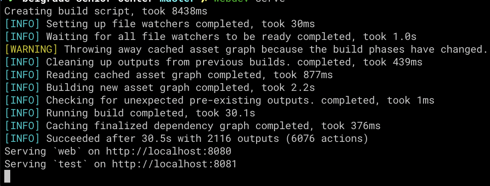
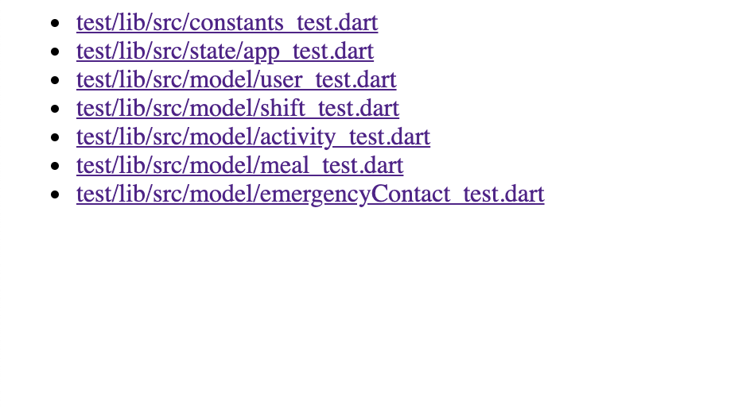
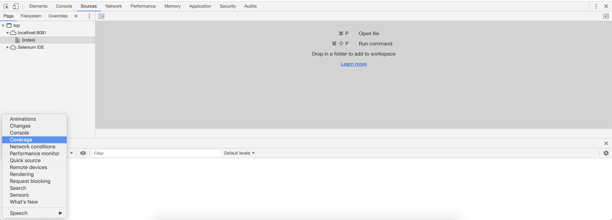
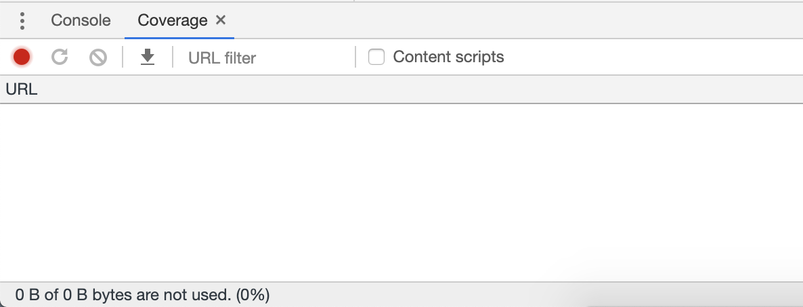
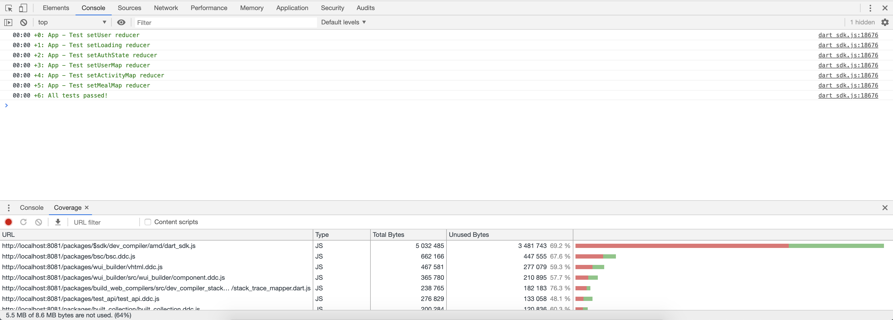
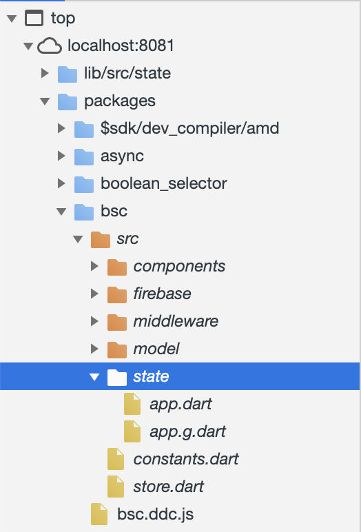
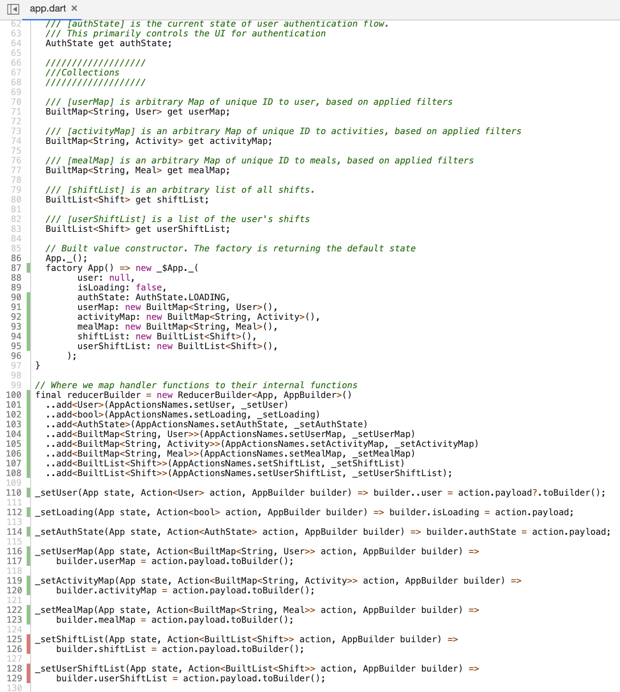

# Belgrade Senior Center

[](https://travis-ci.com/SpencerCornish/belgrade-senior-center)
[](https://travis-ci.com/SpencerCornish/belgrade-senior-center)


## Developer Documentation

To obtain the source code for the Belgrade Senior Center Website, developers should clone the repo [here](https://github.com/SpencerCornish/belgrade-senior-center.git). The  `master` branch contains the source code for the current release, the `development` branch is the bleeding edge.

## Tools and technologies

This is a non-exhaustive list of the tools and technologies we are using.

- [Dart](https://www.dartlang.org/), Programming language
- [Built_Redux](https://github.com/davidmarne/built_redux), State management
- [Wui_Builder](https://github.com/davidmarne/wui_builder), UI Component Toolkit
- [BulmaCSS](https://bulma.io/), CSS Framework
- [Firebase](https://firebase.google.com/), Hosting, etc.
  - [Serverless Functions](https://firebase.google.com/docs/functions/)
  - [Cloud Firestore](https://firebase.google.com/docs/firestore/)
  - [Hosting](https://firebase.google.com/docs/hosting/)
  - [Storage](https://firebase.google.com/docs/storage/)
- [Travis CI](https://travis-ci.org/), for Continuous integration
- [LGTM (Looks good to me)](https://lgtm.com/), for Javascript dependency security vulnerability detection.
- [Plant UML](http://plantuml.com/), for UML diagram.

## Directory Layout

- The `firebase_rulesets` directory contains the rulesets that the database, storage, and hosting system (Firebase) will abide by.

- The `functions` directory contains the backend serverless-functions for the application.

- The `lib` directory holds all of the main Dart source code for the project. This directory contains the following subdirectories:
  - `components` contains the different rendering components of the application. This ranges from the full page containers, to each reusable component, such as the navbar or the footer.
  - `firebase` contains the classes that directly interact with the database, and references to the storage appliance.
  - `middleware` contains Redux middlewares, which are used to intercept pending state changes and perform things  
  - `model` contains immutable models of the datatypes in the app.
  - `state` contains all Redux state and actions for the app.

- The `web` directory contains the static assets for the project, and the entrypoint for the Dart Transpiler.

- The `test` directory contains the files used for testing the Dart source code.

- THe `sass` directory will eventually contain any custom styling for the project.

[Old UML Diagram:](./readme_assets/classDiagram.png)


[UML Diagram:](./readme_assets/classDiagram2.png)


## Directions for Building from Source Code

- Download and install Dart to build the website. Follow the setup instructions for Dart [here](https://webdev.dartlang.org/guides/get-started#2-install-dart).
- Once Dart is installed, install `webdev`:

  ``` bash
    pub global activate webdev
  ```

  Add the pub cache to your path:

  ``` rc
    export PATH="$PATH":"$HOME/.pub-cache/bin"
  ```

- Now navigate to the repository within a terminal window, and use the command `make`. This will print out all avalible commands and their functions:

  ``` bash
  build-js                       build to minified, release js
  firebase-serve                 Serves built JS files locally
  format                         Format the dart files
  install                        Runs pub get to get dependencies
  serve                          Serves the frontend app with ddevc
  ```

  To run locally, type `make serve`. This will serve Just-in-time compiled dart code in javascipt, and automatically recompile for codechanges. to build the real, minified production javascript, run `make firebase-serve`. This will also run the Firebase Cloud Functions locally. This must be reran to regenerate.

## Directions for Testing Source Code

- To run Dart tests, run `make unit-test`.
- To run functional js tests for the firebase serverless functions:
  - Navigate to test/functional
  - run `npm install` in the functions directory
  - run `npm run test`.

## Directions for Accessing test coverage

In Dart 2, generating coverage is surprisingly difficult for Chrome platform tests. As such, generating an LCOV report is not possible. However, viewing coverage is possible.

1. First, run `make serve`

2. Once the application is serving, navigate your browser to <http://localhost:8081>. You will now see links to all tests:


3. Next, open your browser's developer console
`When you want to see logged messages or run JavaScript, press Command+Option+J (Mac) or Control+Shift+J (Windows, Linux, Chrome OS) to jump straight into the Console panel.`

4. Switch to the sources page, and select the lower burger menu, then the coverage option


5. Now, select the record button


6. Select a test link. You will see in the console that these test passed after a short delay


7. From here, selecting the source-mapped file which was tested will show coverage on the left sidebar for the file. In this example, the path would be the following **in the sources panel** `top/localhost:8081/packages/bsc/src/state/app.dart`


8. Once this file has been opened, the coverage will applied by the Chrome sourcemapper automatically (since Dart is transpiled to Javascript) and will be visible in the file explorer!


*It's also possible to view the raw, unmapped coverage data by looking under the coverage tab, if necessary.*

**For example reports of test coverage, [click here](test/coverage-reports/). These are not necessarily up to date.**

## Setting up Automated Weekly Build and Test

The automated build system is run on **Travis CI**. All commits get tested, and the suite runs against master once a day. This is configured in the `.travis.yml` file in the root of the repository. Functional tests also get run on each push to development checking that the build files are correct and login requirements are enforced.

## Releasing New Versions

Whenever a commit is pushed to master, the project is automatically built and deployed using **Travis CI**. This will only happen on tags, or scheduled daily/weekly builds.

Manual deploys are possible using `firebase deploy`, but proper credentials and environment variables must be set. Therefore, local deploys are nontrivial and should be avoided.

## Accessing bug list

- Issues are on the remote repository stored on this [GitHub](https://github.com/SpencerCornish/belgrade-senior-center/issues) page. As bugs or progression steps are found they are added to the issues tab and assigned a user to focus attention on the task.
